# DaimyoSimulator — Design Document

**Project type:** Java rule-based simulation engine inspired by SimCity Lite  
**Scenario:** Ancient Japan village management, around year 1200  
**Main objective:** The player develops and balances a village by placing buildings, assigning villagers indirectly through the available job slots, managing resources, activating one strategy policy at a time, and advancing the simulation through ticks.

This document is written for the GitHub design deliverable. The diagrams use **Mermaid**, which is rendered directly by GitHub Markdown.

---

## 1. Domain Model

### 1.1 Domain overview

DaimyoSimulator is centered on a `Village`. A village contains a logical grid map, the current village state, the available villagers, placed buildings, resources, active policies, and event history. The player does not manually control each villager. Instead, the player constructs buildings, and the simulation assigns available villagers to roles according to the job slots created by those buildings.

The domain is intentionally independent from the graphical presentation. The same core simulation must be usable from unit tests, persistence services, or a future alternative UI without importing libGDX.

The main domain concepts are:

- **Village**: aggregate root of the simulation.
- **Grid**: a rectangular logical map, for example 20x20 cells.
- **Cell**: one map position. It can contain one building or one natural feature.
- **Natural Feature**: forest is generated randomly during map creation and is required by Woodcutter's Huts.
- **Villager**: one person living in the village. A villager can be idle, unhoused, or employed.
- **Role**: the current role assigned to a villager, such as Rice Farmer, Woodcutter, Blacksmith, Artisan, Trader, Samurai, or Monk.
- **Building**: construction placed by the player using timber. Buildings create housing capacity, job slots, production, exchange, or parameter bonuses.
- **Resources**: Rice, Timber, Tools, and Luxury Goods.
- **Village Parameters**: Happiness, Protection, Food, Faith, Housing, and Craftsmanship.
- **Strategy Policy**: one active temporary policy that modifies production, protection, or consumption.
- **Random Event**: condition-based or probability-based event triggered during ticks.

### 1.2 Domain model diagram

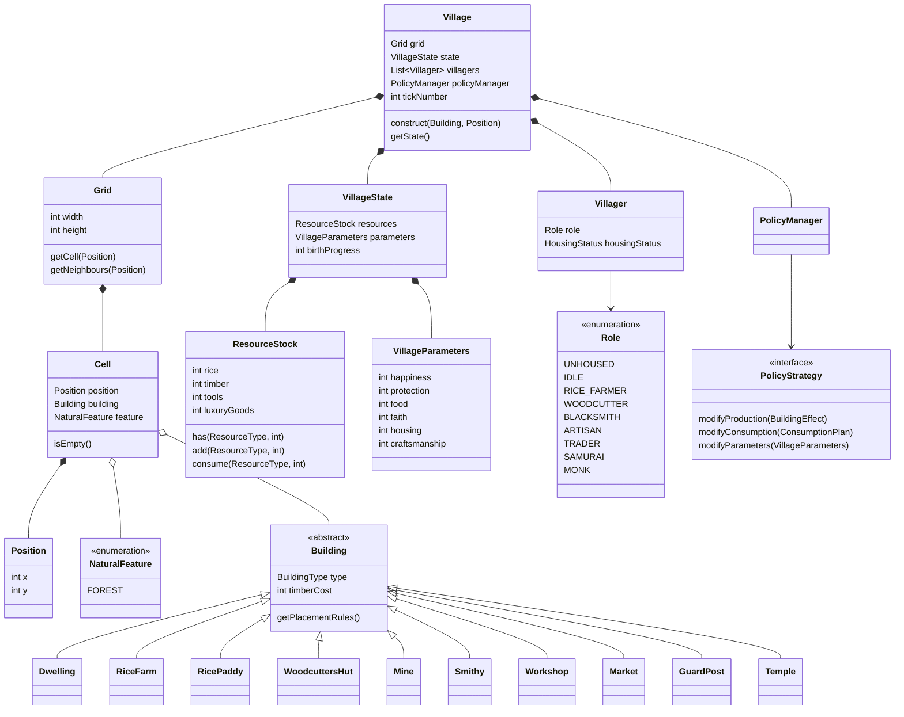

### 1.3 Buildings and responsibilities

| Building | Main responsibility | Job slots / role | Rule enforcement |
|---|---|---|---|
| `Dwelling` | Provides housing capacity | none | Required to house villagers born in the village |
| `RiceFarm` | Holds farmers | Rice Farmer | Needed near Rice Paddies |
| `RicePaddy` | Produces rice | indirectly uses farmers from Rice Farm | Produces only if a Rice Farm is nearby and at least one farmer exists |
| `WoodcuttersHut` | Produces timber | Woodcutter | Must be near forest |
| `Mine` | Unlocks Smithy and Workshop | optional / none | At least one Mine must exist before Smithy or Workshop can be built |
| `Smithy` | Produces tools | Blacksmith | Requires Mine |
| `Workshop` | Produces luxury goods | Artisan | Requires Mine |
| `Market` | Exchanges resources | Trader | Exchange amount and speed depend on traders |
| `GuardPost` | Increases protection | Samurai | Consumes tools/luxury goods under policy effects |
| `Temple` | Increases faith | Monk | Supports faith-based events and happiness |

### 1.4 Resource and parameter model

The central resources are:

- **Rice**: consumed every tick by living villagers. Produced by Rice Paddies.
- **Timber**: consumed when constructing buildings. Produced by Woodcutter's Huts.
- **Tools**: produced by Smithies. Consumed by rice farmers and samurai, especially under policies.
- **Luxury Goods**: produced by Workshops. Consumed by monks and samurai, especially under policies.

The main village parameters are recalculated each tick:

- **Happiness**: global indicator based on the whole village condition.
- **Protection**: based mainly on the ratio between Samurai and villagers.
- **Food**: based on rice stock and expected rice consumption.
- **Faith**: based on monks and temples compared with total population.
- **Housing**: based on housed villagers compared with total villagers.
- **Craftsmanship**: based on available tools, craftsmen, smithies, and workshops.

Happiness is not calculated manually by the player. It is derived from the other parameters by `HappinessCalculator`, so it stays testable and separated from `VillageState`.

---

## 2. System Sequence Diagrams

The following diagrams are **system sequence diagrams**. They show the external interaction between the player and the DaimyoSimulator system without exposing internal classes.

### 2.1 SSD — Create a new village

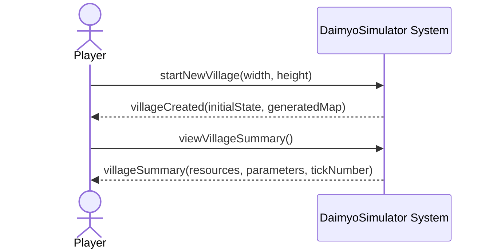

### 2.2 SSD — Construct a building

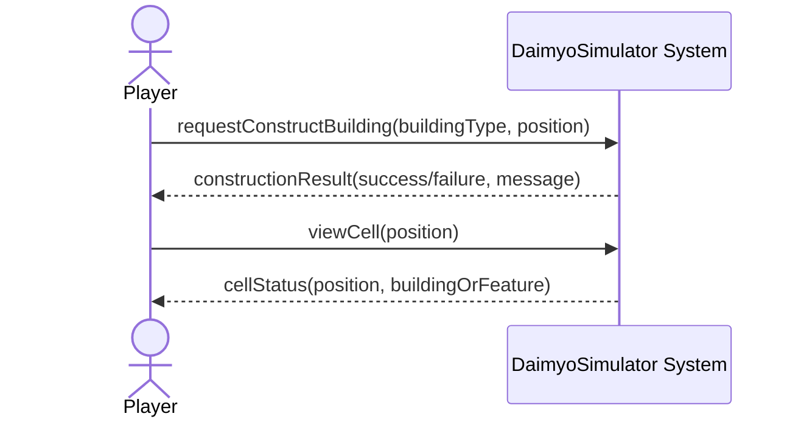

### 2.3 SSD — Advance one tick

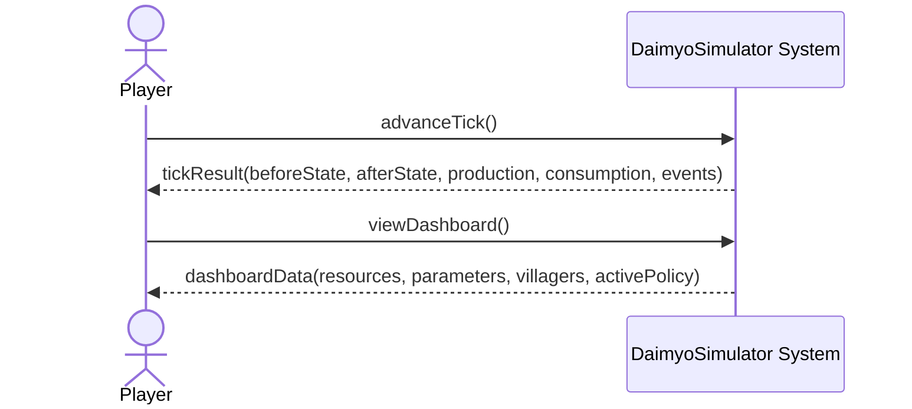

### 2.4 SSD — Activate a strategy policy

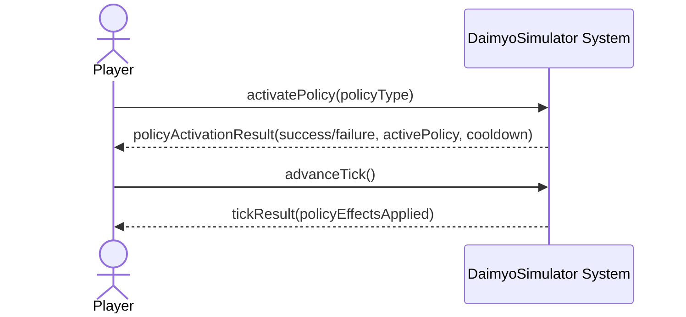

### 2.5 SSD — Save and load village

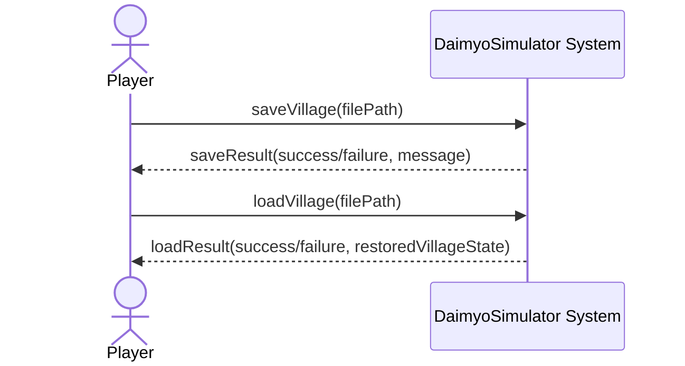

---

## 3. Architectural Organization

### 3.1 Three responsibility split

DaimyoSimulator is separated into three responsibilities:

| Responsibility | Technology | Owns | Must not own |
|---|---|---|---|
| Core Game Logic | Pure Java | Village simulation, logical grid, buildings, placement rules, villagers/jobs, economy/resources, policies, random events, save/load, tick engine | libGDX imports, rendering, Scene2D widgets, camera logic |
| Game World Renderer | libGDX | Drawing the village map, tiles, buildings, forests, animations, SpriteBatch, OrthographicCamera, visual mapping from snapshots | Simulation rules, resource formulas, placement validation, persistence |
| Game UI / HUD | libGDX Scene2D UI | Build buttons, resources, population, parameters, selected building panel, pause/speed/next-tick, policy buttons, event log, menus | Direct mutation of `Village`, `Cell`, `Building`, `ResourceStock`, or `Villager` |

The UI and renderer communicate with the core only through `GameController`, `CoreGameFacade`, application services, DTOs, immutable snapshots, or view models.

### 3.2 Maven multi-module architecture

```text
daimyosimulator/
├── pom.xml
├── src/
│   ├── core/
│   │   ├── pom.xml
│   │   ├── main/...
│   │   └── test/...
│   ├── libgdx/
│   │   ├── pom.xml
│   │   ├── main/...
│   │   ├── main/resources/assets/...
│   │   └── test/...
│   └── desktop/
│       ├── pom.xml
│       └── main/DesktopLauncher.java
```

Dependencies flow in one direction:

```text
desktop
        ↓
libgdx
        ↓
core
```

The forbidden direction is:

```text
core ❌ must not depend on libgdx
```

The core module must compile and run JUnit tests without any `com.badlogic.gdx.*` imports.

### 3.3 Package architecture

#### Core module packages

```text
core
├── application/
│   ├── CoreGameFacade.java
│   ├── GameController.java
│   ├── VillageInitializer.java
│   ├── BuildCommand.java
│   ├── TickCommand.java
│   ├── PlacementResult.java
│   ├── PolicyActivationResult.java
│   └── TickResult.java
├── application/view/
│   ├── VillageSnapshot.java
│   ├── CellViewModel.java
│   ├── BuildingViewModel.java
│   ├── DashboardViewModel.java
│   ├── ResourceViewModel.java
│   ├── PopulationViewModel.java
│   ├── PolicyViewModel.java
│   └── EventLogViewModel.java
├── domain/
│   ├── village/
│   ├── grid/
│   ├── building/
│   ├── villager/
│   ├── resource/
│   ├── policy/
│   ├── rule/
│   └── event/
├── engine/
│   ├── SimulationEngine.java
│   ├── TickProcessor.java
│   ├── TickContext.java
│   ├── JobAssignmentService.java
│   ├── ProductionService.java
│   ├── ConsumptionService.java
│   ├── ShortageService.java
│   ├── BirthDeathService.java
│   ├── VillageParameterCalculator.java
│   └── HappinessCalculator.java
├── factory/
│   ├── BuildingFactory.java
│   └── PolicyFactory.java
└── persistence/
    ├── VillagePersistenceService.java
    ├── VillageMapper.java
    ├── dto/
    └── json/
```

#### libGDX module packages

```text
gdx
├── app/
│   └── DaimyoSimulatorGame.java
├── screen/
│   ├── LoadingScreen.java
│   ├── MainMenuScreen.java
│   └── VillageScreen.java
├── render/
│   ├── WorldRenderer.java
│   ├── TileRenderer.java
│   ├── BuildingRenderer.java
│   ├── NaturalFeatureRenderer.java
│   ├── AnimationRenderer.java
│   ├── GridOverlayRenderer.java
│   └── RenderConstants.java
├── ui/
│   ├── HudStageFactory.java
│   ├── DashboardHud.java
│   ├── BuildMenu.java
│   ├── ResourcePanel.java
│   ├── PopulationPanel.java
│   ├── VillageParameterPanel.java
│   ├── SelectedBuildingPanel.java
│   ├── SpeedControlPanel.java
│   ├── PolicyPanel.java
│   ├── EventLogPanel.java
│   └── MenuOverlay.java
├── input/
│   ├── GameInputProcessor.java
│   ├── CameraController.java
│   ├── BuildModeState.java
│   ├── ScreenToGridMapper.java
│   └── InputCommandRouter.java
├── asset/
│   ├── GameAssetManager.java
│   ├── AssetPaths.java
│   ├── BuildingSpriteRegistry.java
│   ├── TileSpriteRegistry.java
│   ├── IconRegistry.java
│   └── MissingAssetFallback.java
└── adapter/
    ├── SnapshotToRenderModelAdapter.java
    ├── CellRenderModel.java
    ├── BuildingRenderModel.java
    └── HudViewModelAdapter.java
```

#### desktop module package

```text
desktop
└── DesktopLauncher.java
```

---

## 4. Design Class Model

### 4.1 Controller/facade and core class diagram

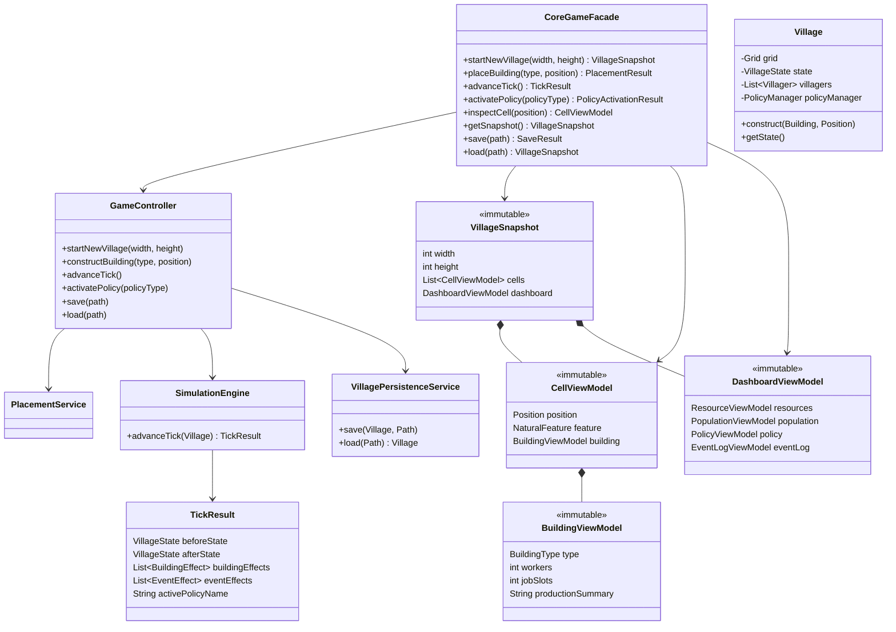

### 4.2 Building hierarchy and interfaces

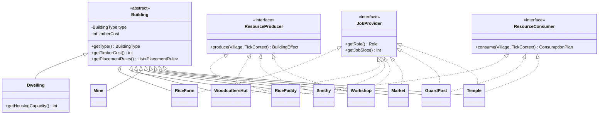

### 4.3 Strategy policies

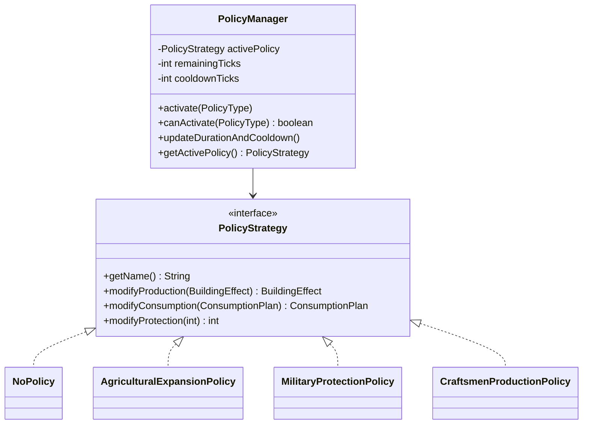

Policy behavior:

| Policy | Production effect | Consumption / cost effect |
|---|---|---|
| `AgriculturalExpansionPolicy` | Rice Paddy production x1.5 | Tool consumption by agriculture x1.5 |
| `MilitaryProtectionPolicy` | Protection value from Samurai x1.5 | Samurai consume x1.5 Tools and Luxury Goods |
| `CraftsmenProductionPolicy` | Timber, Tools, and Luxury Goods production x1.5 | Craftsmen consume x1.5 Rice |

### 4.4 libGDX application structure

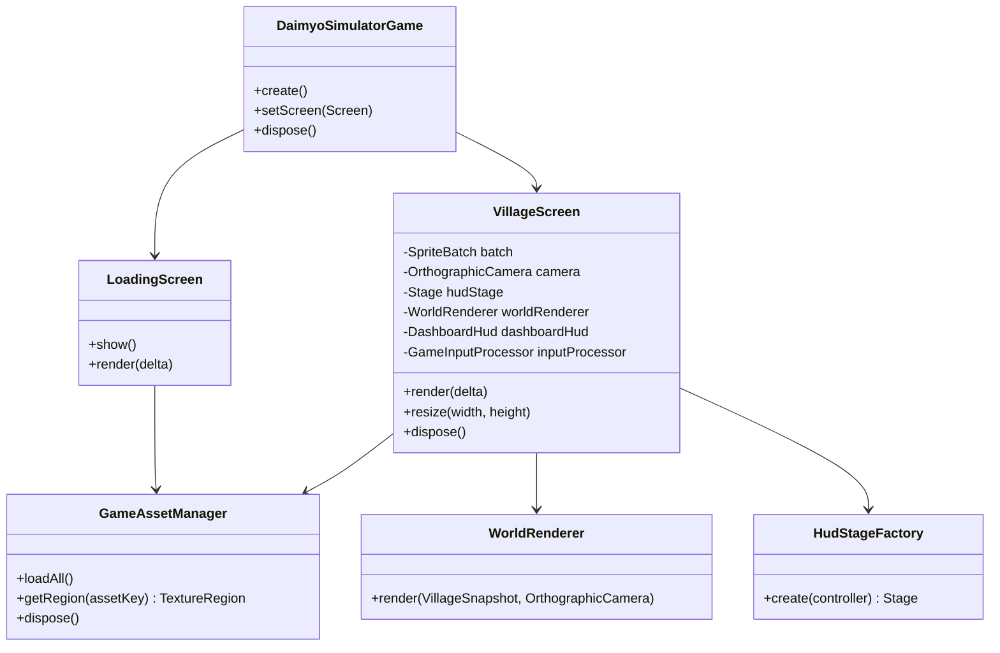

### 4.5 WorldRenderer and UI/HUD collaboration

```mermaid
classDiagram
    class WorldRenderer {
        +render(snapshot, camera)
    }

    class TileRenderer {
        +renderTiles(snapshot)
    }

    class NaturalFeatureRenderer {
        +renderFeatures(snapshot)
    }

    class BuildingRenderer {
        +renderBuildings(snapshot)
    }

    class AnimationRenderer {
        +renderAnimations(snapshot, delta)
    }

    class DashboardHud {
        +refresh(DashboardViewModel)
        +showCell(CellViewModel)
        +showMessage(String)
    }

    class BuildMenu {
        +setBuildMode(BuildingType)
    }

    class ResourcePanel {
        +refresh(ResourceViewModel)
    }

    class PopulationPanel {
        +refresh(PopulationViewModel)
    }

    class SelectedBuildingPanel {
        +show(CellViewModel)
    }

    class SpeedControlPanel {
        +pause()
        +resume()
        +nextTick()
        +setSpeed(multiplier)
    }

    class PolicyPanel {
        +activatePolicy(PolicyType)
    }

    WorldRenderer --> TileRenderer
    WorldRenderer --> NaturalFeatureRenderer
    WorldRenderer --> BuildingRenderer
    WorldRenderer --> AnimationRenderer
    DashboardHud --> BuildMenu
    DashboardHud --> ResourcePanel
    DashboardHud --> PopulationPanel
    DashboardHud --> SelectedBuildingPanel
    DashboardHud --> SpeedControlPanel
    DashboardHud --> PolicyPanel
```

### 4.6 Boundary between libGDX and pure Java core

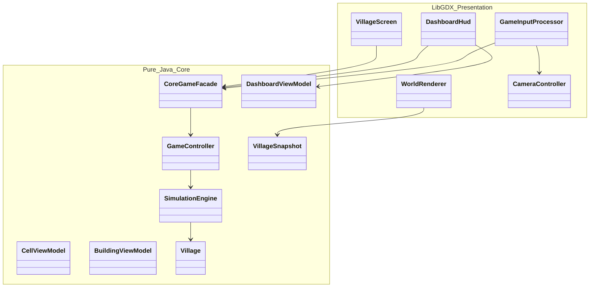

---

## 5. Internal Sequence Diagrams

The following diagrams show the internal object collaboration for the most significant operations.

### 5.1 Internal sequence — Construct a building in the core

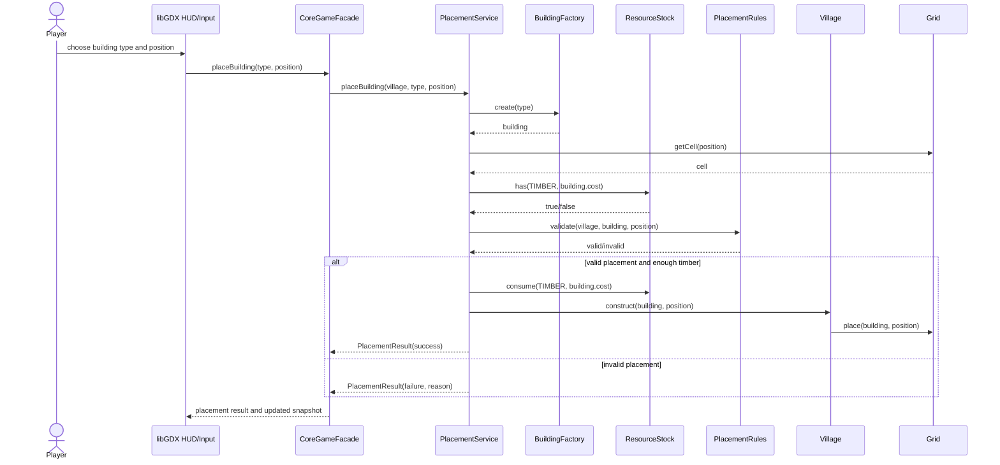

### 5.2 Internal sequence — Advance one tick in the core

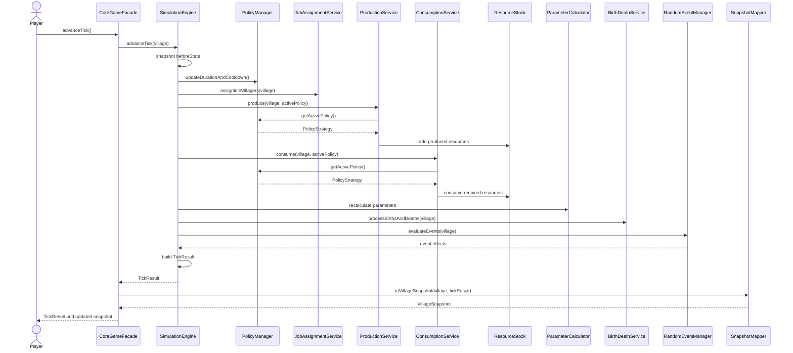

Tick order implemented by `SimulationEngine`:

1. Advance tick counter.
2. Update active policy duration and cooldown.
3. Validate building rules.
4. Assign idle villagers to available jobs.
5. Produce resources.
6. Consume resources.
7. Apply shortages and penalties.
8. Update village parameters.
9. Recalculate happiness.
10. Process births and deaths.
11. Trigger random events if conditions are met.
12. Build `TickResult` and updated immutable view models.

### 5.3 Internal sequence — Activate a strategy policy

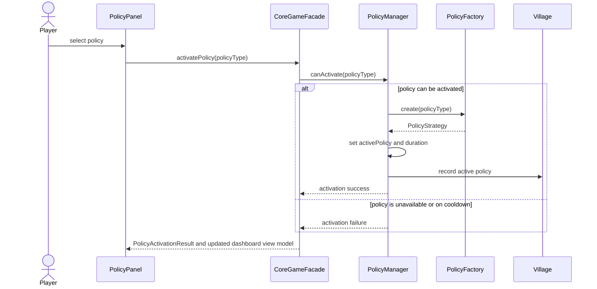

### 5.4 Internal sequence — Save and load village

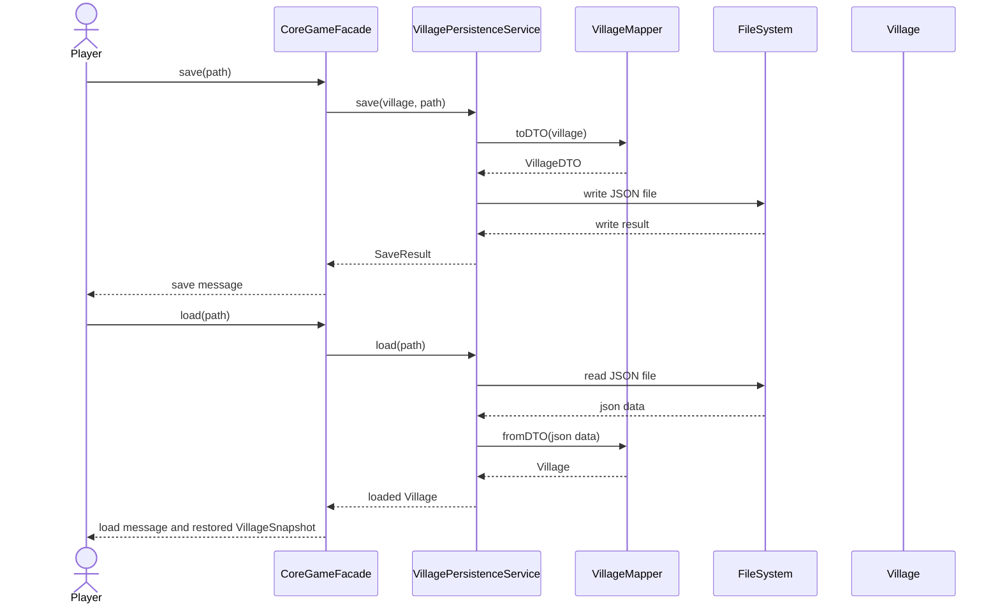

### 5.5 Selecting a building from the HUD and placing it on the map

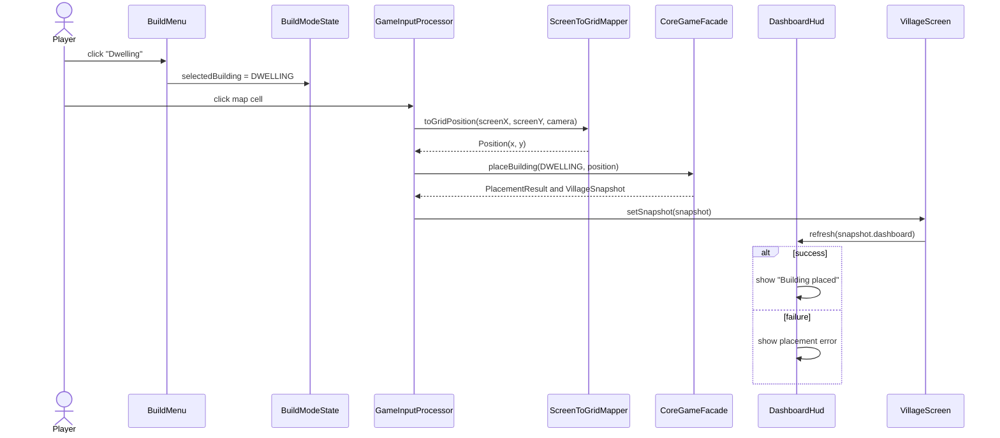

### 5.6 Clicking a cell and opening the selected building panel

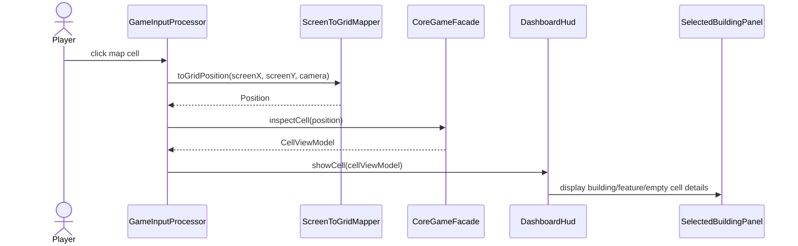

### 5.7 Pressing next tick / pause / speed controls

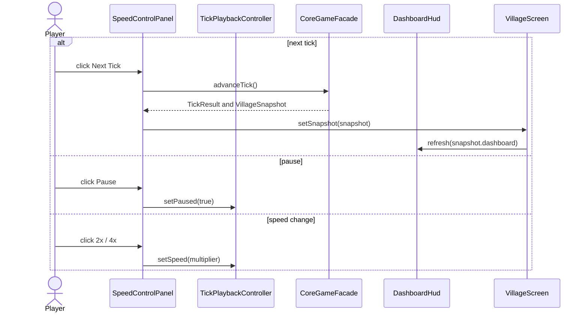

### 5.8 Refreshing the HUD after TickResult

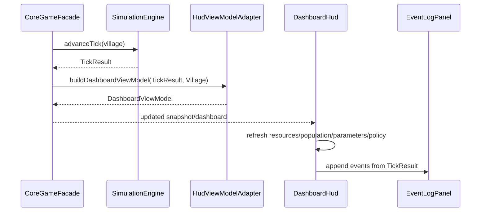

### 5.9 Loading textures/assets at application startup

```mermaid
sequenceDiagram
    participant Game as DaimyoSimulatorGame
    participant Loading as LoadingScreen
    participant Assets as GameAssetManager
    participant Registry as BuildingSpriteRegistry
    participant Screen as VillageScreen

    Game->>Loading: setScreen(LoadingScreen)
    Loading->>Assets: queue TextureAtlas, UI skin, icons, placeholder
    Assets->>Assets: loadAll()
    Assets-->>Loading: loaded
    Loading->>Registry: validate BuildingType/NaturalFeature mappings
    alt all required mappings exist or fallback available
        Loading->>Game: setScreen(VillageScreen)
        Game->>Screen: show()
    else fatal asset configuration error
        Loading->>Loading: show readable error
    end
```

---

## 6. Rendering Flow

The game screen is split into two layers:

```text
Screen
|
|-- World layer
|   rendered with SpriteBatch and OrthographicCamera
|
|-- UI layer
    rendered with Stage and Scene2D UI
```

Recommended `VillageScreen.render(delta)` flow:

1. Read the latest immutable `VillageSnapshot` held by the screen or request it from `CoreGameFacade` after a command.
2. Update camera position and zoom through `CameraController`.
3. Clear the screen.
4. Render the world layer through `WorldRenderer`:
   - ground tiles;
   - forests and other natural features;
   - placed buildings;
   - grid or selection overlays;
   - visual-only animations.
5. Call `hudStage.act(delta)` to update Scene2D UI behavior.
6. Refresh `DashboardHud` only when the snapshot or `TickResult` changes.
7. Call `hudStage.draw()` to render Scene2D UI.

`render(delta)` must never execute simulation rules. It must not calculate production, consumption, placement validity, job assignment, random events, births/deaths, policy effects, or persistence. Simulation state changes happen only when a command is sent to the controller/facade.

---

## 7. Input Flow

Use a libGDX `InputMultiplexer`:

```text
InputMultiplexer
├── Stage input processor          // UI buttons first
└── GameInputProcessor             // map/camera input if UI did not consume event
```

### 7.1 Camera pan and zoom

`CameraController` handles:

- keyboard pan with WASD or arrow keys;
- mouse drag or middle-button drag pan;
- mouse wheel or trackpad zoom;
- min/max zoom clamp;
- optional map bounds clamp.

Camera movement is visual only and must not touch the core domain model.

### 7.2 Build mode and map cell selection

1. Player selects a building button in `BuildMenu`.
2. `BuildMenu` updates `BuildModeState`.
3. Player clicks the world map.
4. `GameInputProcessor` calls `ScreenToGridMapper`.
5. `ScreenToGridMapper` uses `camera.unproject(screenX, screenY)`, then computes:
   - `gridX = floor(worldX / TILE_SIZE)`;
   - `gridY = floor(worldY / TILE_SIZE)`.
6. The mapper returns a core `Position(gridX, gridY)`.
7. If build mode is active, `GameInputProcessor` calls `CoreGameFacade.placeBuilding(buildingType, position)`.
8. If build mode is not active, `GameInputProcessor` calls `CoreGameFacade.inspectCell(position)`.
9. The HUD refreshes from returned `PlacementResult`, `CellViewModel`, or `VillageSnapshot`.

### 7.3 UI button events

| UI action | libGDX component | Core call / effect |
|---|---|---|
| Select build type | `BuildMenu` | Updates `BuildModeState`; no immediate domain mutation |
| Place building | `GameInputProcessor` | `CoreGameFacade.placeBuilding(type, position)` |
| Select cell | `GameInputProcessor` | `CoreGameFacade.inspectCell(position)` |
| Next tick | `SpeedControlPanel` | `CoreGameFacade.advanceTick()` |
| Pause/speed | `SpeedControlPanel` | Updates tick playback timing only |
| Activate policy | `PolicyPanel` | `CoreGameFacade.activatePolicy(policyType)` |
| Save/load | `MenuOverlay` | `CoreGameFacade.save(path)` / `CoreGameFacade.load(path)` |

---

## 8. Asset Pipeline

### 8.1 Assets folder structure

```text
src/libgdx/main/resources/assets/
├── atlases/
│   ├── village.atlas
│   └── ui.atlas
├── textures/
│   ├── tiles/
│   │   ├── tile_grass.png
│   │   ├── tile_dirt.png
│   │   └── tile_selection.png
│   ├── features/
│   │   └── feature_forest.png
│   ├── buildings/
│   │   ├── building_dwelling.png
│   │   ├── building_rice_farm.png
│   │   ├── building_rice_paddy.png
│   │   ├── building_woodcutters_hut.png
│   │   ├── building_mine.png
│   │   ├── building_smithy.png
│   │   ├── building_workshop.png
│   │   ├── building_market.png
│   │   ├── building_guard_post.png
│   │   └── building_temple.png
│   ├── icons/
│   │   ├── icon_resource_rice.png
│   │   ├── icon_resource_timber.png
│   │   ├── icon_resource_tools.png
│   │   ├── icon_resource_luxury_goods.png
│   │   ├── icon_policy_agricultural_expansion.png
│   │   ├── icon_policy_military_protection.png
│   │   └── icon_policy_craftsmen_production.png
│   └── placeholders/
│       └── missing_asset.png
├── skins/
│   ├── daimyo-ui.json
│   └── daimyo-ui.atlas
└── mapping/
    └── sprite-map.json
```

### 8.2 Naming convention

```text
tile_<terrain>.png
feature_<feature_type>.png
building_<building_type>.png
building_<building_type>_<animation_state>_<frame>.png
icon_resource_<resource_type>.png
icon_policy_<policy_type>.png
ui_<component>.png
```

Examples:

```text
building_dwelling.png
building_guard_post.png
feature_forest.png
icon_resource_rice.png
icon_policy_agricultural_expansion.png
```

### 8.3 TextureAtlas and individual textures

During early development, individual PNG files are acceptable because they are easier to replace manually. Before the final delivery, the project should pack stable sprites into `village.atlas` and access them through `TextureRegion` names.

### 8.4 BuildingType-to-sprite mapping

| Core type | Asset key |
|---|---|
| `BuildingType.DWELLING` | `building_dwelling` |
| `BuildingType.RICE_FARM` | `building_rice_farm` |
| `BuildingType.RICE_PADDY` | `building_rice_paddy` |
| `BuildingType.WOODCUTTERS_HUT` | `building_woodcutters_hut` |
| `BuildingType.MINE` | `building_mine` |
| `BuildingType.SMITHY` | `building_smithy` |
| `BuildingType.WORKSHOP` | `building_workshop` |
| `BuildingType.MARKET` | `building_market` |
| `BuildingType.GUARD_POST` | `building_guard_post` |
| `BuildingType.TEMPLE` | `building_temple` |
| `NaturalFeature.FOREST` | `feature_forest` |

The mapping is owned by the libGDX module. The core knows only domain enums and must not know file paths, texture names, `TextureRegion`, `Animation`, or `AssetManager`.

### 8.5 Missing asset fallback

During development:

1. `GameAssetManager` logs a warning such as `Missing sprite for BuildingType.SMITHY`.
2. `MissingAssetFallback` returns `missing_asset.png`.
3. The game continues running.
4. Final release validation can fail if required production assets are still missing.

---

## 9. Design Decisions and Pattern Mapping

| Requirement / problem | Design decision | Pattern / principle |
|---|---|---|
| Different policies modify production and consumption | Represent each policy as a `PolicyStrategy` | Strategy Pattern |
| Building creation should not be hardcoded inside the engine | Use `BuildingFactory` and `BuildingType` | Factory Pattern |
| UI should not own the model | Scene2D HUD talks to `CoreGameFacade` and receives immutable view models | MVC / Clean Architecture |
| Renderer should not run rules | `WorldRenderer` draws `VillageSnapshot` only | Single Responsibility |
| Save/load must not use a database | Use JSON DTOs through `VillagePersistenceService` | DTO + Service |
| Simulation tick must remain understandable and testable | Split tick work into services: job assignment, production, consumption, parameters, birth/death, events | GRASP / Single Responsibility |
| Placement rules must be extensible | Implement separate `PlacementRule` classes | Open/Closed Principle |
| Building behavior must be polymorphic | Use abstract `Building` plus interfaces like `JobProvider` and `ResourceProducer` | Inheritance + interfaces |
| Missing art during development should not block testing | Use placeholder sprite and warning | Fail-soft development workflow |

---

## 10. Testing Strategy

### 10.1 Core unit tests

Core logic remains pure JUnit and does not require libGDX initialization. Suggested tests:

```text
GridTest
CellTest
PositionTest
BuildingFactoryTest
PlacementRuleTest
ConstructionServiceTest
SimulationEngineTest
TickProcessorOrderTest
PolicyStrategyTest
RandomEventManagerTest
VillagePersistenceServiceTest
VillageSnapshotMapperTest
```

### 10.2 Controller/facade tests

`CoreGameFacade` and `GameController` should be unit-tested with deterministic services or fake dependencies:

- placement delegates to `PlacementService`;
- invalid placement does not change the snapshot;
- `advanceTick()` returns `TickResult` and updated `DashboardViewModel`;
- policy activation respects one active policy and cooldowns;
- `inspectCell()` returns `CellViewModel`, not a mutable `Cell`.

### 10.3 Renderer/UI tests

Renderer and UI classes should stay thin and are mainly validated through integration, manual, and system tests:

- asset loading smoke test;
- missing asset fallback check;
- screen-to-grid coordinate mapping test;
- manual check for camera pan/zoom;
- manual check for HUD refresh after placement and ticks.

Acceptance criteria must verify that UI actions go through the controller/facade and never mutate domain objects directly.

---

## 11. Traceability to User Stories

| Design area | Related user stories |
|---|---|
| Village initialization and grid | US-01 |
| General building construction | US-02 |
| Placement and prerequisite rules | US-03 |
| Villagers and roles | US-04 |
| Dwellings and housing | US-05 |
| Automatic job assignment | US-06 |
| Rice production and consumption | US-07 |
| Timber, Tools, Luxury Goods production | US-08 |
| Markets and resource exchange | US-09 |
| Tick engine | US-10 |
| Village parameters and happiness | US-11 |
| Birth and death | US-12 |
| Strategy policies | US-13 |
| Random events | US-14 |
| Save and load | US-15 |
| libGDX renderer, HUD, and dashboard | US-16 |

---

## 12. Notes for Implementation

- Keep domain logic independent from the UI and renderer.
- Do not create a single class that performs all calculations. `SimulationEngine` coordinates the tick, while specialized services calculate the details.
- Keep formulas simple and deterministic where possible. Random events should use a `RandomProvider` or fixed seed during unit tests.
- The `core` module must never import `com.badlogic.gdx.*`.
- The libGDX module may depend on the core, but it must use immutable snapshots/view models instead of mutable domain objects.
- `WorldRenderer` must draw the world only. It must not enforce placement rules or run production/consumption logic.
- `DashboardHud` and Scene2D panels must call `CoreGameFacade` or `GameController` for commands.
- All important rules should have unit tests: invalid placement, resource shortage, policy effects, rice production, death by starvation, birth with enough food/housing/happiness, and save/load integrity.
- Mermaid diagrams in this document can be copied directly into GitHub and rendered automatically.
