# DaimyoSimulator — Design Document

**Project type:** Java rule-based simulation engine inspired by SimCity Lite — Ancient Japan village management (~year 1200).

**Main objective:** the player develops and balances a village by placing buildings, letting the simulation assign villagers to the job slots those buildings create, managing resources, activating one strategy policy at a time, and advancing the simulation through ticks.

The core simulation is pure Java (no libGDX), so it is usable from unit tests, persistence, or any UI. The libGDX module renders immutable snapshots and sends commands through `CoreGameFacade`. Diagrams use **Mermaid**, rendered directly by GitHub.

---

## 1. Domain Model

DaimyoSimulator is centered on a `Village` (aggregate root) holding a logical `Grid`, the current `VillageState` (resources + parameters), the `Villager` list, the active policy, and the tick counter. The player does not control villagers directly: they construct buildings, and the simulation assigns idle villagers to the job slots created by those buildings.

Main concepts:

- **Grid / Cell / Position** — a rectangular logical map (e.g. 20×20); each cell holds at most one building or one natural feature.
- **Natural Feature** — `FOREST`, generated randomly at map creation; required near Woodcutter's Huts.
- **Villager / Role** — a person who is unhoused, idle, or employed (Rice Farmer, Woodcutter, Blacksmith, Artisan, Trader, Samurai, Monk).
- **Building** — placed by the player using timber; provides housing, job slots, production, exchange, or bonuses.
- **Resources** — Rice, Timber, Tools, Luxury Goods.
- **Village Parameters** — Happiness, Protection, Food, Faith, Housing, Craftsmanship; recalculated every tick. Happiness is derived from the other parameters by `HappinessCalculator`, keeping it testable and separate from `VillageState`.
- **Strategy Policy** — one active temporary policy modifying production, protection, or consumption.
- **Random Event** — condition- or probability-based, triggered during ticks.

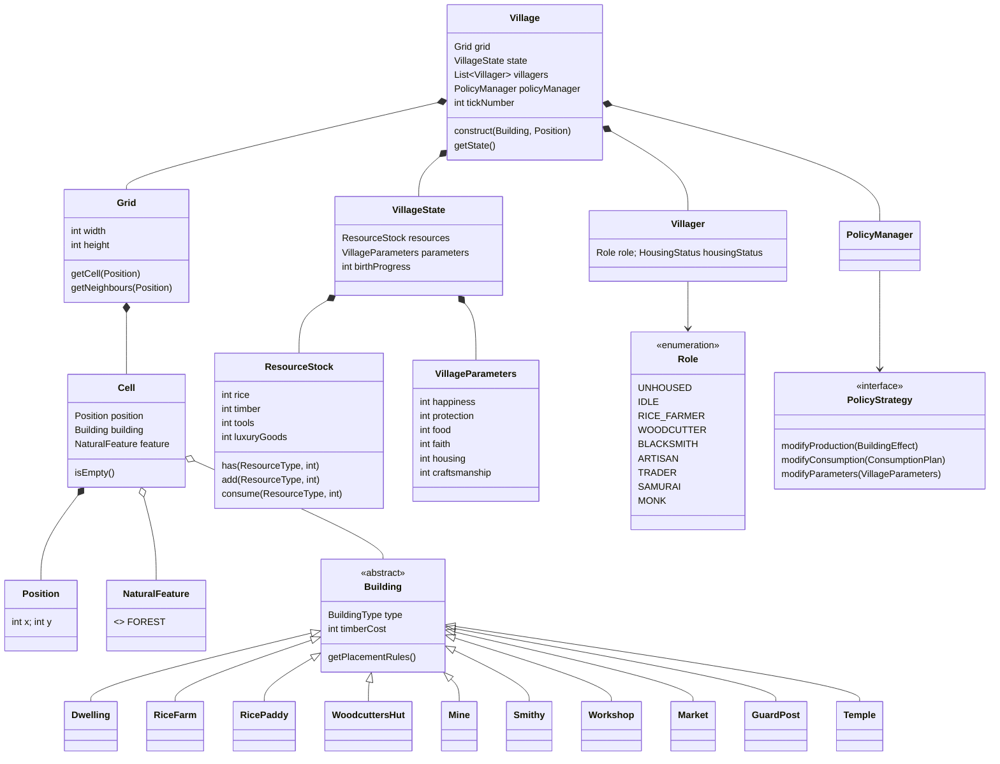

**Buildings (responsibility / job slots / key rule):** `Dwelling` (housing 4) · `RiceFarm` (Rice Farmer ×3) · `RicePaddy` (rice; needs a Rice Farm in range + ≥1 farmer) · `WoodcuttersHut` (timber, Woodcutter ×3; **must be within range 1 of a Forest**) · `Mine` (lets adjacent Smithy/Workshop produce) · `Smithy` (tools, Blacksmith ×2; needs Mine in range) · `Workshop` (luxury goods, Artisan ×2; needs Mine in range) · `Market` (exchange, Trader ×2; shared, 10-tick cooldown) · `GuardPost` (protection, Samurai ×2) · `Temple` (faith, Monk ×2).

---

## 2. System Sequence Diagrams

These show external interaction between the player and the system, without internal classes.

**2.1 — Create a new village**

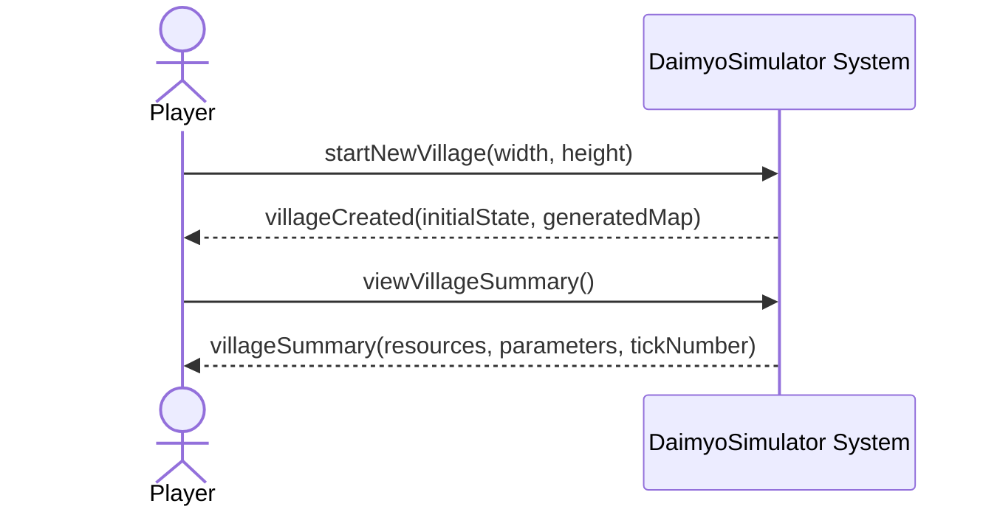

**2.2 — Construct a building**

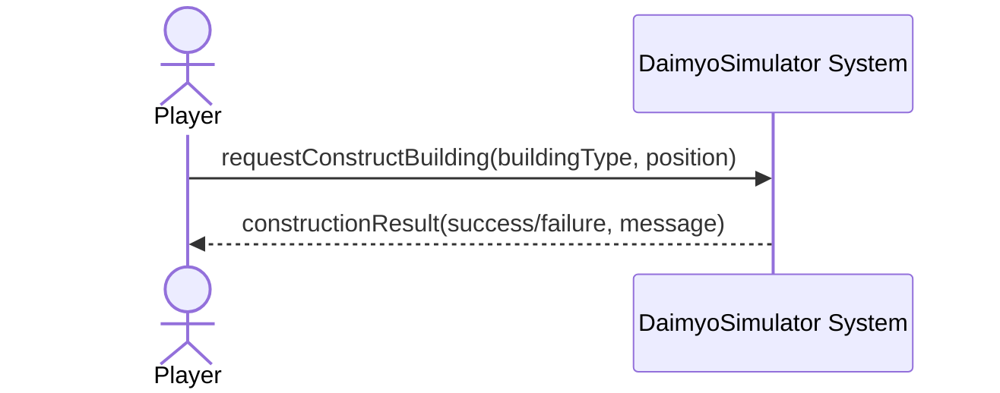

**2.3 — Advance one tick**

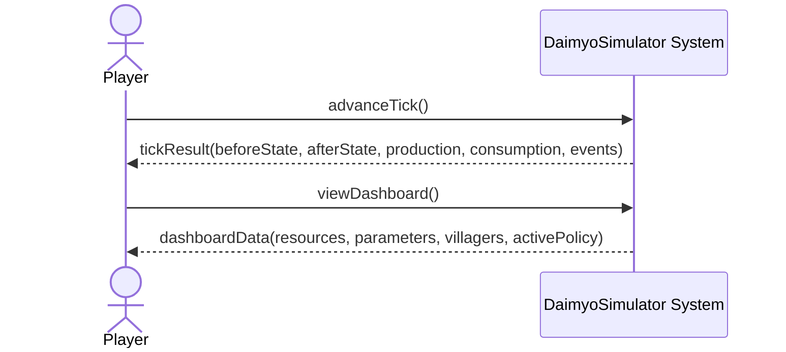

**2.4 — Activate a strategy policy**

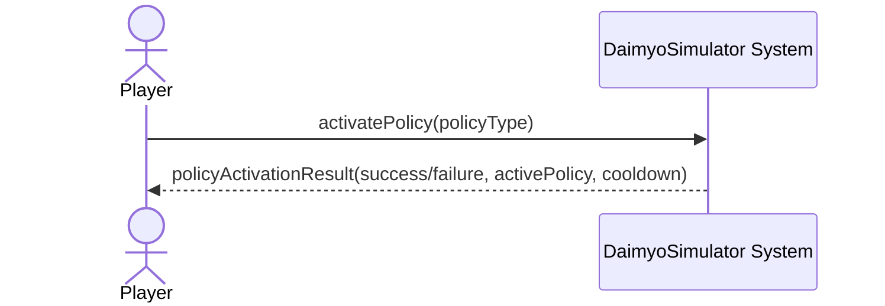

**2.5 — Save and load**

---

## 3. Design Class Model

The core is a pure-Java domain reached through `CoreGameFacade` → `GameController`, which delegates to specialized services and returns immutable view models (`VillageSnapshot`, `CellViewModel`, `DashboardViewModel`). The libGDX presentation never touches mutable domain objects.

**3.1 — Application boundary and core**

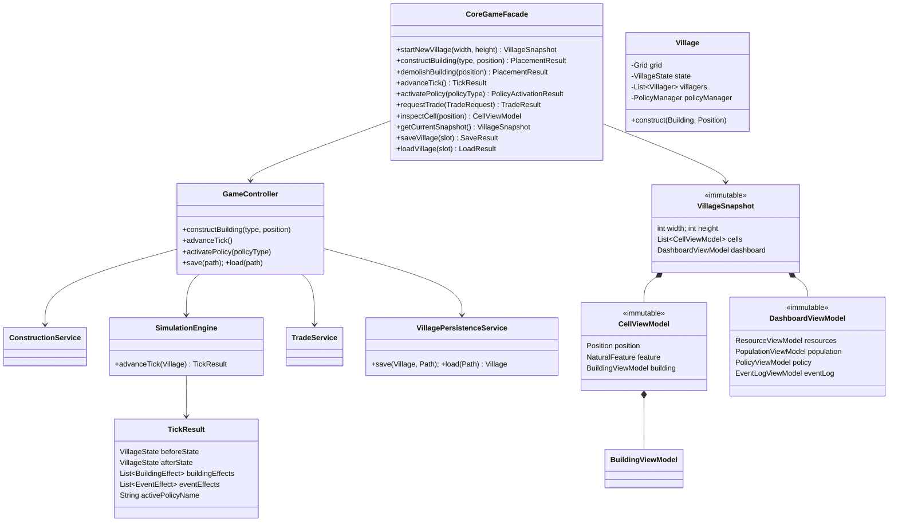

**3.2 — Building hierarchy (data-driven).** Each building declares timber cost, housing capacity, job slots (`Map<Role,Integer>`), and placement rules; production/consumption are computed by the tick services from these declarations — there are no per-building `produce`/`consume` methods.

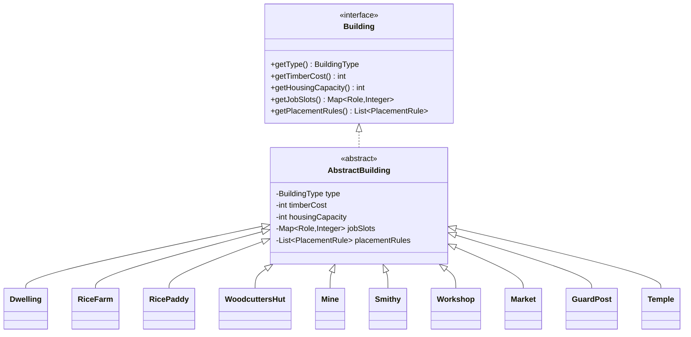

**3.3 — Strategy policies.** One policy is active at a time, managed by `PolicyManager` with duration + cooldown.

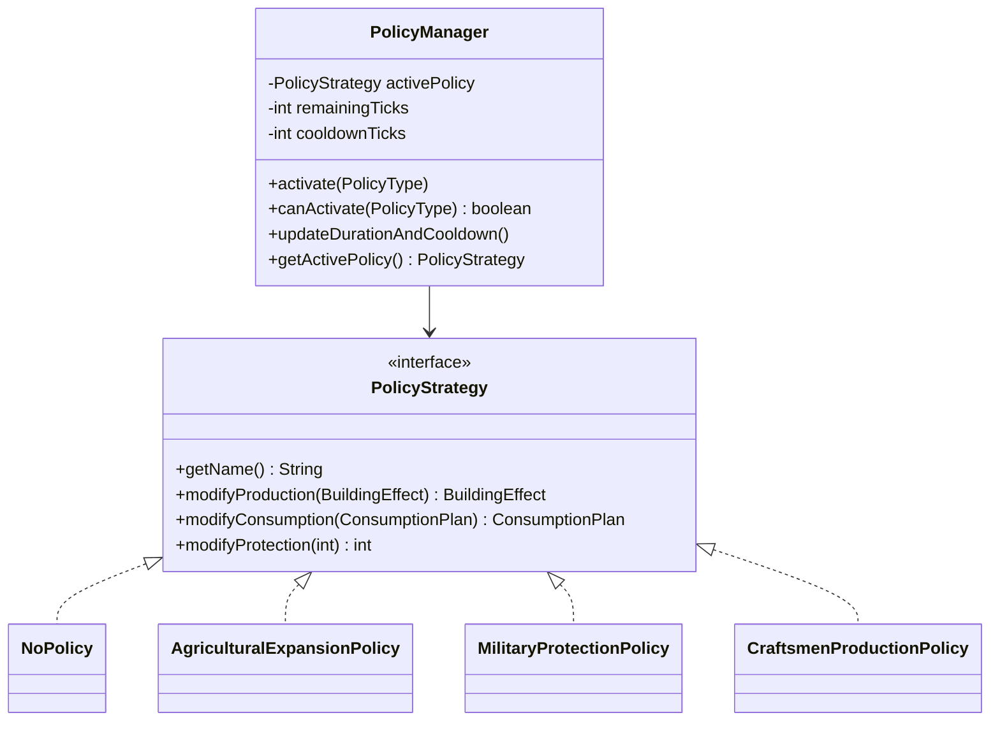

| Policy | Production effect | Consumption / cost effect |
|---|---|---|
| `AgriculturalExpansionPolicy` | Rice Paddy ×1.5 | Agriculture tool consumption ×1.5 |
| `MilitaryProtectionPolicy` | Samurai protection ×1.5 | Samurai consume ×1.5 Tools + Luxury |
| `CraftsmenProductionPolicy` | Timber/Tools/Luxury ×1.5 | Craftsmen consume ×1.5 Rice |

**3.4 — libGDX / core boundary.** The presentation depends on the core only through the facade and immutable view models; the core never imports `com.badlogic.gdx.*`.

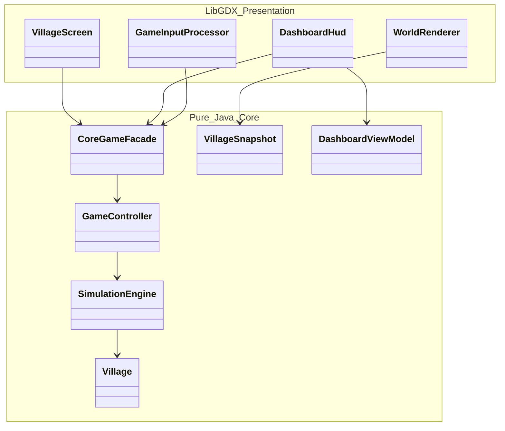

---

## 4. Internal Sequence Diagrams

The most significant internal object collaborations.

**4.1 — Construct a building**

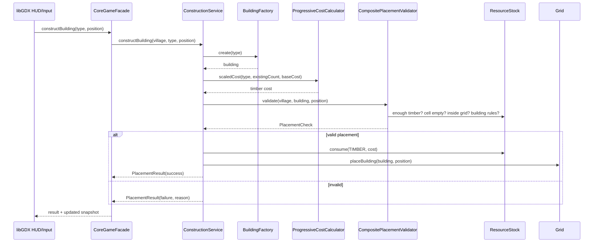

**4.2 — Advance one tick.** Orchestrated by `SimulationEngine`/`TickProcessor`: snapshot *before* → advance counter, reset build quota, decrement market cooldown → update policy duration/cooldown → assign **one** idle villager (weighted by free slots) → produce → consume → apply shortages/penalties → luxury-deprivation desertion → recalculate parameters → births/deaths → random events → build `TickResult`.

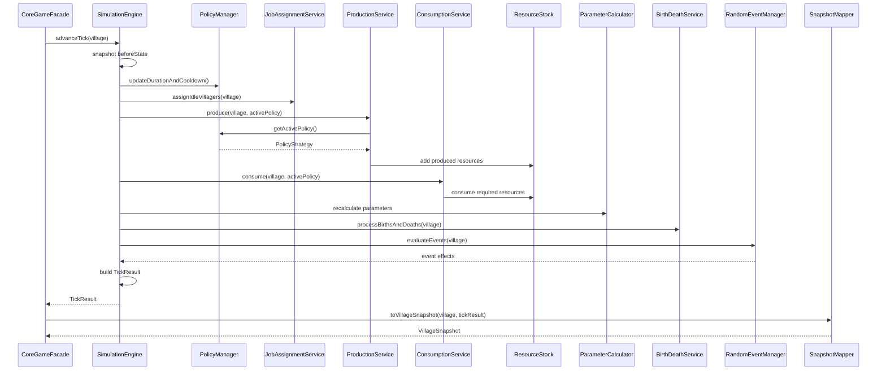

**4.3 — Activate a strategy policy**

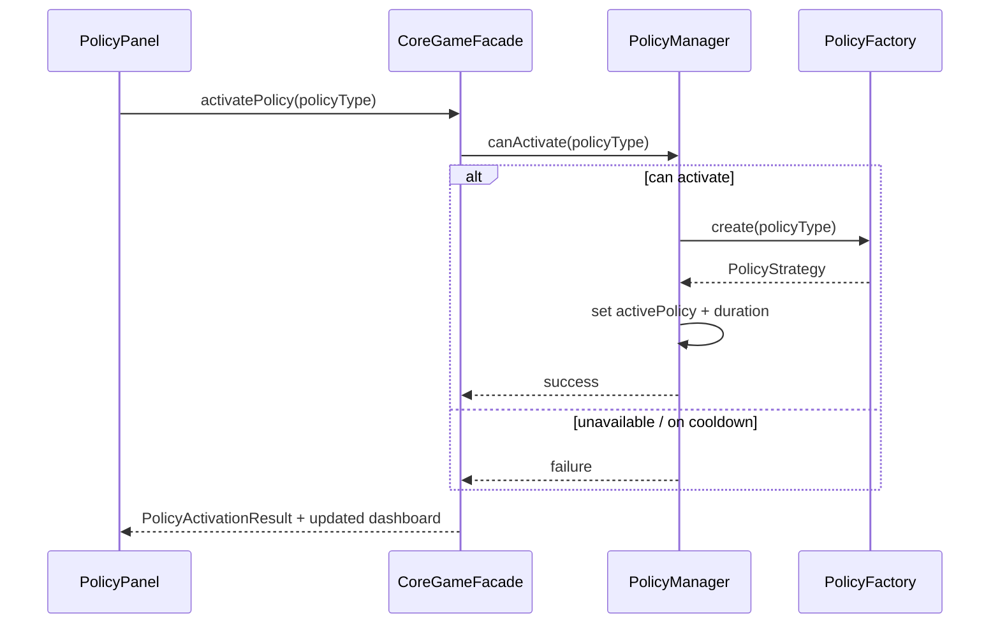

**4.4 — Save and load**

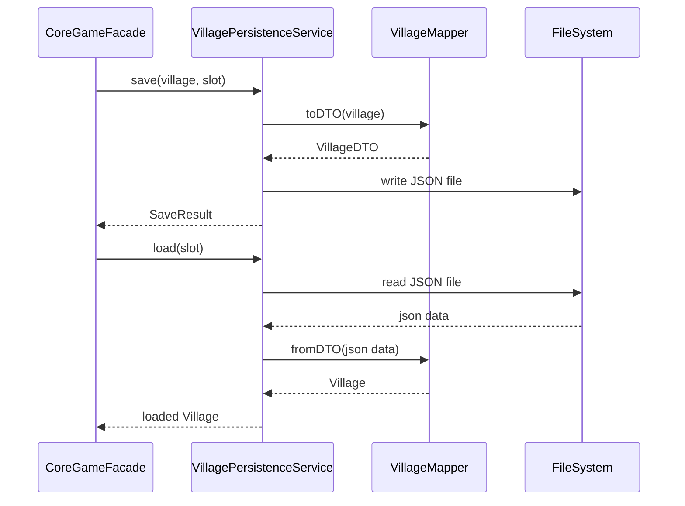
